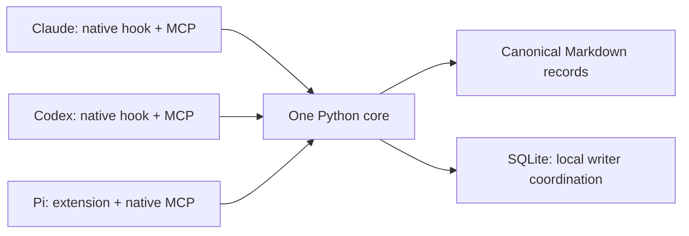

<p align="center"></p>

# shared-memory-mcp

Small shared Markdown memory for **Claude Code, Codex CLI, and Pi**, with independent native memories.

The initial deployment stores data at `/data/CoordExp/.shared-memory/`. Source lives in this independent repository. Sessions keep their existing working directories; the central registry chooses applicable project, worktree, and task records.

## Architecture



The core uses Python's standard library. Only the stdio transport needs the official MCP SDK. Each harness starts its own MCP process over the same configured root. There is no daemon, background model extraction, embedding service, automatic Git commit, or mandatory search index.

```text
shared-data-root/
├── registry.json
├── records/
│   └── <stable-project-id>/
│       └── <record-id>.md
├── routing/<stable-project-id>.json
├── curation/<stable-project-id>/<record-id>.json
├── sharing.json                    # optional directional engineering allowlist
├── .writer-gate.sqlite3
└── .state/
    ├── adapters/shared-memory.ts
    └── config-backups/
```

Markdown holds captured content and publication replay identities. Optional JSON curation journals bind reviewed recall metadata to the exact record content digest without rewriting its Markdown. SQLite only serializes cooperating local writers; replay receipts live in published files, not the lock database. Atomic file publication and idempotent operation stages provide recovery after interruption.

One accepted successor contains `supersedes` links. Old records remain intact; effective superseded status is derived from the full project corpus before query ranking. Expiring a successor does not restore its predecessor.

## Setup

Python 3.11+ is required. Current native compatibility is qualified on Linux with Claude Code 2.1.288, Codex 0.159.2, and Pi 1.0.1.

From a checkout:

```sh
git clone https://github.com/Pein2017/shared-memory-mcp.git
cd shared-memory-mcp
python -m venv .venv
.venv/bin/pip install -e '.[mcp,test]'
.venv/bin/shared-memory --root /path/to/central-memory init
.venv/bin/shared-memory --root /path/to/central-memory register \
  --project-id my-project --project-root /path/to/repository
```

Register a repository's actual top level to recognize its linked worktrees. Registering only a subdirectory binds only that subtree. Independent nested repositories require their own explicit registration; ambiguous or unknown contexts inject no project memory. The registry's project ID is portable; its filesystem/Git bindings are local deployment configuration.

An authorized agent can discover an unregistered task repository with `shared-memory --root <store> project --cwd <actual-cwd>`, inspect the verified Git identity and proposed registration, run the existing `register` invocation, then retry with the resolved project ID. Ordinary first-party task registration needs no separate user approval. Discovery and memory read operations stay read-only; they never silently register or import parent-project knowledge. Name/identity conflicts and restricted subtree bindings remain explicit. Registration does not create cross-project sharing permissions. Native startup diagnostics retain bounded onboarding guidance without injecting another project's memories.

Review installation, then apply the same arguments:

```sh
python scripts/install-local.py \
  --root /path/to/central-memory --cli /absolute/path/to/.venv/bin/shared-memory \
  --codex-home /path/to/codex-home --pi-dir /path/to/pi-agent-dir \
  --cwd /path/to/registered-project
# Append --apply to install.
```

The default installer registers one Codex SessionStart hook, the Codex/Pi MCP entries, a configured Pi extension wrapper, and one `codex-home/skills/shared-memory` symlink to the bundled skill. Add `--claude-dir /path/to/claude-config` to explicitly include Claude's SessionStart hook and native user-scoped MCP registration. Omitting that option accesses no Claude configuration. The CoordExp deployment reuses its existing shared skill links; it creates no Claude/Pi skill copy.

Codex hook trust is established through the installed native app-server's discovered hash for exactly the owned hook. Other trust entries and settings are preserved. Configuration backups are private under `.state/config-backups/`; do not commit them.

Claude installation preserves its default model, native-memory settings, other hooks, and account/MCP configuration. Start a fresh native session after installation. Existing sessions may retain their original tool/configuration snapshot.

## Using memory

Startup recall supplies a bounded `<shared-memory-context>` view with actual `caller_context`. Supply that context to MCP tools rather than inventing a session ID or using the server cwd.

A fixed reminder precedes the bounded wrapper. Empty-query startup reads curated routing and actual caller identity, not record bodies, their age order, dynamic counts or an inferred task. Missing routing is explicit; scope failure exposes diagnostics and injects no project memory. The single [shared-memory skill](skills/shared-memory/SKILL.md) defaults to targeted recall after a nontrivial task is known, without a mandatory search gate or per-turn injection. Ask one question with a few discriminating entity/mechanism terms instead of a whole task keyword bag; agents may open a known owner directly. Check version/conditions and relevant negative evidence before choosing a result. The `truncated` flag can describe top-k pagination, previewed bodies or omitted routing, and is not a precision score.

MCP has static tool order/descriptions and explicit effect annotations; these are client hints, not authorization. Startup and task results use the same core, but MCP `context` omits a duplicate rendered text representation, and `read` omits operation receipts unless `audit=true`. Native adapters still receive their text renderer. A worker without its own caller context returns source-linked proposed content rather than copying a parent's identity.

| Tool | Purpose |
| --- | --- |
| `context` | Stable startup navigation, or task cards for an explicit query |
| `search` | Field-aware lexical cards, routes, match reasons and revision-fenced pagination |
| `read` | Full bodies, sources and conditions; history and detailed audit on request |
| `create` | Candidate capture with a source-event idempotency key |
| `approve` | Explicit review, preserving the captured content |
| `update` | Publish successor candidate `id`, retiring exact-scope `old_ids` |
| `delete` | Reviewed withdrawal of one record; retain original contents and audit history |
| `capture` | One-call capture; supplied source review publishes, otherwise keep a candidate |
| `curate` | Reviewed metadata/sharing or retirement from default recall; preserve original bytes |

Pi exposes these nine tools directly; the seven existing operation names remain available. Native namespaces may prefix their names, for example `mcp__shared_memory__update`. Codex may expose MCP tools through its native deferred discovery/code-mode catalog; absence from the initial direct tool list does not mean the server is disconnected.
Version 0.2 replaces the old `memory_context/search/read/propose/promote/supersede` names with the names above. Reconnect MCP clients or start fresh sessions to refresh tool catalogs. There are no legacy aliases. Server/tool icons are embedded SVG metadata; the shared skill also supplies its own local logo. Actual rendering depends on client support.
Search returns source-linked cards, not full review/proposal envelopes. A reviewed summary can be self-contained; legacy long bodies use explicitly incomplete previews. Oversized cards retain an ID and read pointer rather than silently hiding a match. `read` recovers every original body/source/provenance field; `audit=true` includes review and curation history. Follow next_offset with expected_revision=corpus_revision; a changed corpus/query requires a fresh search. The 12,000-byte bound covers escaped/indented JSON as well as the ordinary core projection. The official SDK still provides both structured content and an interoperable text fallback; clients may expose both, so the combined transport is not advertised as 12,000 bytes.

A proposal has:

```json
{
  "kind": "hypothesis",
  "title": "Mechanism to test",
  "body": "A conditional explanation, its alternative, and the evidence boundary.",
  "scope": "project",
  "sources": [
    {"uri": "file:///path/to/research/owner.md", "locator": "commit or section", "note": "Original evidence"}
  ]
}
```

Existing record kinds remain readable. `capture` accepts the same record plus optional details and review={reason,evidence}. A source-checking authorized agent may publish low-risk material in one call; omitted review leaves a candidate. Details can carry a summary, conditions, domain/topics/aliases, statement_type, observed_at, source_roles and sparse source-linked relations. These are optional, not a research ontology. A published hypothesis remains a hypothesis. Source validation is structural; review is caller-supplied and does not certify truth or grant execution rights.

Use project scope for durable shared knowledge, worktree scope for local continuation, and task scope when a real task ID is supplied. Worktree IDs represent canonical checkout paths, not branch identities. Available Git commit/branch are captured as origin provenance; they do not automatically invalidate a record on every new commit or branch switch. Version-specific statements must retain their conditions/source revisions and be revalidated before consequential use.

Capture non-obvious durable lessons and conditional findings, not implementation changelogs or whole handoffs. Handoff transport/workflow stays independent; extract worthwhile content separately only when needed. Repeated summaries are not independent evidence. Existing research/OpenSpec/code/artifact owners remain authoritative. Use source_roles to distinguish owner, evidence, derivative and origin. Historical observations retain their conditions and event date; version-related operational statements require current-source checks rather than automatic age decay.

New `kind=handoff` memory proposals/captures/publications are rejected. Local handoff documents remain supported and are read directly by receiving sessions. Legacy handoff records remain decodable, retireable/withdrawable and explicitly readable as history; completed identical legacy calls can replay, while unfinished legacy handoff operations cannot newly publish. Do not relabel routine progress to bypass admission. The schema may retain a deprecated handoff value to admit completed historical replay; this is not permission for a new write. The shared [operation examples](skills/shared-memory/references/operations.md) show reviewed capture, candidate correction and registration with real caller identity.

To correct knowledge: `create` a successor candidate, check its sources, then `update` with the new candidate ID, old IDs, review and operation key. `update` publishes the reviewed successor; it does not edit an old body in place. To withdraw knowledge without a replacement: `delete` with the target ID, source-linked review and operation key. It appends a withdrawal marker and hides both marker and target from normal recall. `read/search(include_inactive=true)` retain their history. Withdrawn candidates cannot be approved. Withdrawing a successor never reactivates its predecessors; restore knowledge with a new candidate and review. Delete is logical withdrawal, not physical erasure.

Same operation key and payload replay the original publication. Reusing a key for different content fails. Promotion cannot rewrite accepted content. Supersession requires the same project and exact scope qualifiers. Optional UTC `expires_at` removes temporary material from normal recall; history remains available.

## Routing, sharing and retirement

`routing/<project>.json` contains version=1, a short description and topics with id/title/when/sources plus optional aliases, search_terms and memory_ids. Owner links remain useful without local memory IDs. Aliases discover a topic; **only explicit search_terms expand a query**. Co-membership in a broad topic is not synonymy. Ranking uses meaningful word/identifier/CJK matches, field weights, term rarity and length normalization; Latin character fragments alone do not admit records. Domain is only a soft preference; relevance is not evidence strength. No embeddings, mandatory index or per-topic synthesis is required.

Optional `sharing.json` has `{"version":1,"allow":[{"from":"project-a","to":"project-b","domain":"engineering"}]}`. The target receives a foreign record only when it is published, project-scoped, not retired, and separately curated with domain=engineering and share_with=["project-b"]. Imported reads retain project-a attribution; mutations never inherit imported visibility. No implicit research, candidate, worktree, task or historical-record export occurs.

`curate(..., retired=true, review=..., idempotency_key=...)` removes default recall without declaring a record false. The original Markdown remains intact and history reads remain available. Supply expected_content_digest and expected_revision from a full read to fence a reviewed change. Clearing retirement cannot revive underlying expiry, withdrawal or supersession. Correcting the same claim can use update; differing experiment conditions or interpretations may simply coexist.

Curation is a bounded, digest-bound operation journal, not an independent evidence store. Exact replay recovers interrupted operations; changed reuse fails. Capture binds its complete request in a small atomic receipt under `capture/<project>/` before creating a candidate. An interruption can leave only that receipt or an unpublished candidate; retry the identical payload and key. Completed pre-repair captures recover their binding from the curation journal. A pre-repair candidate without that binding fails with `incomplete_capture`; its original review/details cannot safely be inferred.

Older running processes do not hot-reload source, tool schemas or curation behavior. An intermediate reader that rejects newly added routing fields such as `search_terms` can fail recall instead of merely returning an older view. Reconnect the affected client, or use the fresh CLI public-operation bridge; do not remove valid routing metadata to satisfy a stale reader. This migration does not rewrite version-1 records or restart sessions. Refresh all consumers before producing new canonical records with caller kinds that an older release does not recognize, including webcodex.

For WebCodex without a configured MCP gateway, the same nine public operations are available through `shared-memory --root <store> call --tool <operation>` with JSON arguments on stdin. Use harness=webcodex, the actual Workflow Session and verified process cwd. The bridge returns the same compact MCP projection; the native `context` subcommand still renders hook text. This does not register a new Runner service or substitute WebCodex's separate memory bootstrap.

## Record format and audit

Each UTF-8 Markdown file starts with one fenced JSON metadata block, then the readable body. Metadata contains schema version, stable ID, project/applicability, kind/status, origin, sources, timestamps, proposal/review operation identities, and optional supersession/expiry. A reviewed withdrawal marker instead carries `withdraws` and its own review operation identity, without a fabricated proposal. Both target and marker retain their original scope. Existing records need no migration; older readers reject unfamiliar markers explicitly.

The write gateway maintains serialization, digests, and lifecycle invariants. Inspect/diff canonical Markdown freely; use a successor for corrections instead of hand-editing accepted records. Metadata validates structure and replay consistency; it does not authenticate authors or establish scientific truth.

Keep raw/candidate/operational records, curation audit, local registry/sharing bindings, backups and derived state outside Git by default. Selected curated routing may be tracked by the existing owner repository; no new repository or automatic Git operation is needed. Git is not a concurrent writer lock. Rebind local roots deliberately when moving a store; worktree/task applicability does not silently follow renamed checkouts.

## Operational limits

- Supported writers cooperate on one Linux host and a local filesystem. Network-shared filesystems, multiple hosts, and unrestricted concurrent external editors are unqualified.
- Task recall scans canonical project files, with a 10,000-record project ceiling and a 1 MiB record/journal ceiling. Exceeding a bound fails explicitly. Startup defaults to eight routing entries/6,000 Unicode characters; it reports entries not shown and does not scan record bodies. Whole routing/card entries that cannot fit are skipped without truncating their meaning. Full reads are intentionally outside compact search/startup budgets.
- Lexical search can miss synonyms. A rebuildable FTS cache is a later option; freshness must include corpus membership and supersession edges, not just returned-file timestamps.
- Provenance and review references are self-reported cooperating-agent metadata. Source validation is syntactic; semantic review remains the agent/user owner's responsibility.
- Claude/Codex startup/resume/clear/compact hooks append bounded current snapshots. They cannot erase earlier conversation history or compacted summaries. Pi inserts one ephemeral user-level snapshot before ordinary conversation, after any leading system messages exposed by the caller. Unchanged recall stays at that position during ordinary growth; startup/resume/compact and caller-identity changes refresh it, and failed refresh removes it. Native Pi history is unchanged. Real-model resume/compaction and Claude fork sessions remain unmeasured; event envelopes are source/fixture checked.
- Lifecycle hooks perform recall only. No guaranteed transcript distillation, automatic scientific consolidation, time-based truth decay, or physical deletion is provided; `delete` retains auditable withdrawal history.
- The fixed workflow reminder consumes part of the existing startup budget. If a supported small budget cannot hold the complete reminder and required scope/caller wrapper, context returns an empty diagnostic view. Reminder delivery does not establish that a model followed it or used every relevant record.

## Diagnostics and rollback

```sh
shared-memory --root /path/to/central-memory doctor
shared-memory --root /path/to/central-memory context \
  --cwd /path/to/project --harness codex --session-id actual-session-id --actor main
```

Unknown/ambiguous scope produces empty startup recall and a diagnostic. Navigation declares records_not_loaded; task search/read and doctor validate canonical records and curation and fail explicitly on corruption. Missing coordination state can be reconciled from canonical operation identities; stop all writers before removing or replacing the coordination database. It is operational state, not a disposable live search cache. Unpublished temporary files are not knowledge.

Rollback removes only the `shared-memory` MCP entries, the exact owned SessionStart commands, the owned Codex trust key, the configured Pi extension path, and the matching shared skill symlink. Claude's owned entries are in its `settings.json` and user `.claude.json`. Leave canonical records and unrelated settings intact. Backups identify each original configuration; avoid restoring an entire old configuration over later user changes.

## Validation

- Unit/consumer tests cover project/worktree/task isolation, collisions, concurrent writers, crash recovery, idempotency, supersession/expiry, provenance, corruption, budgets, and native hook envelopes.
- Official SDK stdio clients exercise capture/review and fresh-process recall.
- Installed Claude/Codex startup injection is verified in serialized requests against a local rejecting test provider. Installed Pi Web and managed CLI SDK 1.0.3 consumers verify the ordinary-growth converted prefix, user-level recall, replacement, lifecycle freshness, failure clearing and unchanged native history without inference. The real CLI/MCP probe also checks prefix preservation through the installed loader/session dispatch and `convertToLlm`.
- Historical pre-curation qualification used three real GPT-6-Luna sessions for Codex capture, Pi cross-read/capture and fresh Codex cross-read. It does not qualify the new recall/publication contract or prove agent compliance. This upgrade adds CPU, actual stdio MCP and installed Pi SDK tests with zero model/provider calls.
- Historical pre-curation native Haiku qualification used two sessions for startup consumption, peer fixture reads, explicit reviewed publication and fresh-session recall. Independent Codex/Pi SDK clients read the same Claude publication; these are synthetic peer clients, not additional paid Codex/Pi sessions. Native init/assistant events verify the exact `claude-haiku-4-5-20251001` model and origin session.
- Wheel installation is checked from outside this source tree; the core works when MCP imports are blocked.

Run local tests with `python -m pytest -q` after installing the checkout. Native CPU probe: `python tests/native_startup_probe.py --harness all` (Claude/Codex/Pi). It requires installed harnesses and does not call a real model provider.

Run the Pi adapter regression against an installed SDK with `PI_SDK_ROOT=/path/to/@earendil-works/pi-coding-agent node tests/pi_adapters.mjs`. Its executable fixture supplies recall while the actual SDK loads the extension and dispatches lifecycle/context events. This qualifies CPU prefix correctness, not a provider cache-hit improvement. Refreshing recalled content legitimately changes the early prefix; freshness takes priority over cache reuse. Any cache improvement claim requires a measured model/backend, request population, contrast and raw usage denominator. The snapshot timestamp is stable within a successful refresh epoch for internal message equality; this does not imply that timestamps reach the provider or affect its cache.

Explicit paid Haiku qualification: `python tests/claude_haiku_probe.py --live --claude-dir /path/to/existing/claude-config`. It permits two sessions capped at USD 1 each, uses an existing unexpired access token only in child environment, and copies no refresh token. The ordinary test suite never runs it. Haiku effort metadata is absent; the test omits effort/fallback flags and does not use `--bare`, which disables startup hooks.

After installation, native Haiku usage is `claude --print --model claude-haiku-4-5-20251001 -- "Your task"`. To check the actual configured startup without inference, use `python tests/claude_haiku_probe.py --actual-startup --claude-dir /path/to/claude-config --actual-cwd /path/to/registered-project --memory-root /path/to/central-memory`. This uses a local rejecting provider and disables auto-memory/account MCP only for that test invocation; stored native settings are preserved.

The current [recall and curation change](openspec/changes/improve-memory-recall-and-lifecycle/proposal.md) records the new navigation, publication, migration and compatibility contract. Live migration receipts remain private under the store's `.state/migrations/`; future dreaming can reuse record enumeration, source identities, derivation metadata and idempotent operations without adding a scheduler now.

The owning changes are the [initial core/Codex/Pi implementation](openspec/changes/build-shared-memory-mcp/proposal.md), [Claude qualification](openspec/changes/qualify-claude-haiku/proposal.md), [direct tools, withdrawal and branding](openspec/changes/simplify-memory-tools-and-branding/proposal.md) and [stable Pi recall prefix](openspec/changes/stabilize-pi-context-prefix/proposal.md). Local validation receipts live under ignored `outputs/`; they are implementation evidence, not research results.
