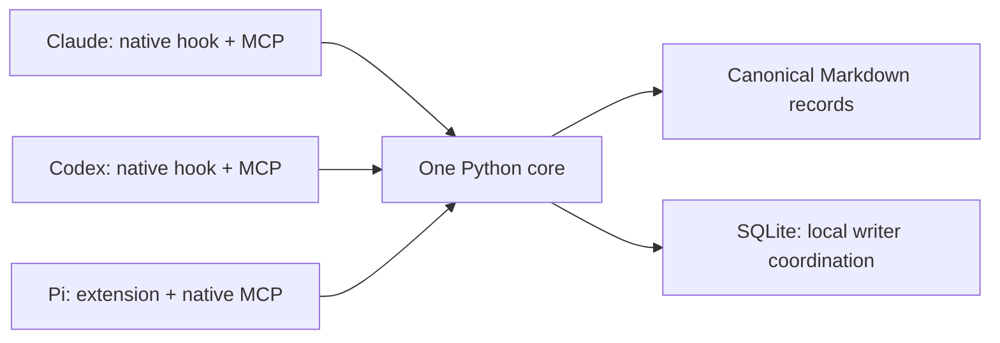

<p align="center"></p>

# shared-memory-mcp

Small shared Markdown memory for **Claude Code, Codex CLI, and Pi**, with independent native memories.

The initial deployment stores data at `/data/CoordExp/.shared-memory/`. Source lives in this independent repository. Sessions keep their existing working directories; the central registry chooses applicable project, worktree, and task records.

## Architecture



The core uses Python's standard library. Only the stdio transport needs the official MCP SDK. Each harness starts its own MCP process over the same configured root. There is no daemon, background model extraction, embedding service, automatic Git commit, or mandatory search index.

```text
shared-data-root/
├── registry.json
├── records/
│   └── <stable-project-id>/
│       └── <record-id>.md
├── .writer-gate.sqlite3
└── .state/
    ├── adapters/shared-memory.ts
    └── config-backups/
```

Markdown holds knowledge and replay identities; SQLite serializes cooperating local writers and records operation receipts. SQLite and file publication are not one transaction: canonical operation metadata supports recovery after publication precedes receipt commit.

One accepted successor contains `supersedes` links. Old records remain intact; effective superseded status is derived from the full project corpus before query ranking. Expiring a successor does not restore its predecessor.

## Setup

Python 3.11+ is required. Current native compatibility is qualified on Linux with Claude Code 2.1.288, Codex 0.159.2, and Pi 1.0.1.

From a checkout:

```sh
git clone https://github.com/Pein2017/shared-memory-mcp.git
cd shared-memory-mcp
python -m venv .venv
.venv/bin/pip install -e '.[mcp,test]'
.venv/bin/shared-memory --root /path/to/central-memory init
.venv/bin/shared-memory --root /path/to/central-memory register \
  --project-id my-project --project-root /path/to/repository
```

Register a repository's actual top level to recognize its linked worktrees. Registering only a subdirectory binds only that subtree. Independent nested repositories require their own explicit registration; ambiguous or unknown contexts inject no project memory. The registry's project ID is portable; its filesystem/Git bindings are local deployment configuration.

Review installation, then apply the same arguments:

```sh
python scripts/install-local.py \
  --root /path/to/central-memory --cli /absolute/path/to/.venv/bin/shared-memory \
  --codex-home /path/to/codex-home --pi-dir /path/to/pi-agent-dir \
  --cwd /path/to/registered-project
# Append --apply to install.
```

The default installer registers one Codex SessionStart hook, the Codex/Pi MCP entries, a configured Pi extension wrapper, and one `codex-home/skills/shared-memory` symlink to the bundled skill. Add `--claude-dir /path/to/claude-config` to explicitly include Claude's SessionStart hook and native user-scoped MCP registration. Omitting that option accesses no Claude configuration. The CoordExp deployment reuses its existing shared skill links; it creates no Claude/Pi skill copy.

Codex hook trust is established through the installed native app-server's discovered hash for exactly the owned hook. Other trust entries and settings are preserved. Configuration backups are private under `.state/config-backups/`; do not commit them.

Claude installation preserves its default model, native-memory settings, other hooks, and account/MCP configuration. Start a fresh native session after installation. Existing sessions may retain their original tool/configuration snapshot.

## Using memory

Startup recall supplies a bounded `<shared-memory-context>` view with actual `caller_context`. Supply that context to MCP tools rather than inventing a session ID or using the server cwd.

A fixed source-owned reminder precedes the recalled-record wrapper and shares its total character budget. It is delivered even when a registered project has no matching active records; scope failures still inject nothing. It points to the single [shared-memory skill](skills/shared-memory/SKILL.md), which owns proactive task/topic retrieval, semantic candidate capture and reviewed corrections. For project navigation, query `shared memory topic map` when one exists; default startup ranking does not prioritize that record automatically.

MCP initialization and operation descriptions expose the workflow entry and use triggers. Delegation briefs identify recall/capture duties and the designated consolidator. A worker without its own native caller context returns source-linked candidate content to the lead rather than copying the parent's identity. These instructions improve discovery and deterministic delivery; they cannot guarantee model compliance or enforce reviewer roles.

| Tool | Purpose |
| --- | --- |
| `context` | Fresh bounded startup/task view |
| `search` | Scoped lexical listings within a 12,000-byte response budget |
| `read` | Full records by ID; optional historical visibility |
| `create` | Candidate capture with a source-event idempotency key |
| `approve` | Explicit review, preserving the captured content |
| `update` | Publish successor candidate `id`, retiring exact-scope `old_ids` |
| `delete` | Reviewed withdrawal of one record; retain original contents and audit history |

Pi exposes these seven tools directly. Native namespaces may prefix their names, for example `mcp__shared_memory__update`. Codex may expose MCP tools through its native deferred discovery/code-mode catalog; absence from the initial direct tool list does not mean the server is disconnected.
Version 0.2 replaces the old `memory_context/search/read/propose/promote/supersede` names with the names above. Reconnect MCP clients or start fresh sessions to refresh tool catalogs. There are no legacy aliases. Server/tool icons are embedded SVG metadata; the shared skill also supplies its own local logo. Actual rendering depends on client support.
Search keeps complete short bodies when they fit. Larger bodies are omitted with explicit size information; use `memory_read` for the complete record. Listings preserve source and provenance fields or omit the whole item when it cannot fit. The response reports omitted matches. The 12,000-byte bound covers the core JSON envelope; MCP may encode it as both text and structured content.

A proposal has:

```json
{
  "kind": "hypothesis",
  "title": "Mechanism to test",
  "body": "A conditional explanation, its alternative, and the evidence boundary.",
  "scope": "project",
  "sources": [
    {"uri": "file:///path/to/research/owner.md", "locator": "commit or section", "note": "Original evidence"}
  ]
}
```

Kinds are observation, evidence, hypothesis, decision, experiment, result, invariant, bug/root-cause, and handoff. Captures start as candidates. Promotion requires `review={reason,evidence}`; the main agent/designated consolidator validates the original sources and respects existing user-owned scientific and decision boundaries. Active means eligible for recall, not established truth.

Use project scope for durable shared knowledge, worktree scope for local continuation, and task scope when a real task ID is supplied. Worktree IDs represent canonical checkout paths, not branch identities. Available Git commit/branch are captured as origin provenance; they do not automatically invalidate a record on every new commit or branch switch. Version-specific statements must retain their conditions/source revisions and be revalidated before consequential use.

Capture at meaningful decisions, conclusions, failures/root causes, and handoffs. Ordinary tool activity and recalled summaries create no records. Repeated recollection does not count as independent corroboration. Existing research/OpenSpec/artifact owners remain authoritative; keep memory compact and link to them.

To correct knowledge: `create` a successor candidate, check its sources, then `update` with the new candidate ID, old IDs, review and operation key. `update` publishes the reviewed successor; it does not edit an old body in place. To withdraw knowledge without a replacement: `delete` with the target ID, source-linked review and operation key. It appends a withdrawal marker and hides both marker and target from normal recall. `read/search(include_inactive=true)` retain their history. Withdrawn candidates cannot be approved. Withdrawing a successor never reactivates its predecessors; restore knowledge with a new candidate and review. Delete is logical withdrawal, not physical erasure.

Same operation key and payload replay the original publication. Reusing a key for different content fails. Promotion cannot rewrite accepted content. Supersession requires the same project and exact scope qualifiers. Optional UTC `expires_at` removes temporary material from normal recall; history remains available.

## Record format and audit

Each UTF-8 Markdown file starts with one fenced JSON metadata block, then the readable body. Metadata contains schema version, stable ID, project/applicability, kind/status, origin, sources, timestamps, proposal/review operation identities, and optional supersession/expiry. A reviewed withdrawal marker instead carries `withdraws` and its own review operation identity, without a fabricated proposal. Both target and marker retain their original scope. Existing records need no migration; older readers reject unfamiliar markers explicitly.

The write gateway maintains serialization, digests, and lifecycle invariants. Inspect/diff canonical Markdown freely; use a successor for corrections instead of hand-editing accepted records. Metadata validates structure and replay consistency; it does not authenticate authors or establish scientific truth.

Track canonical files and registry configuration with Git if desired. Git is user-controlled history/sync, not a concurrent writer lock. Rebind local project roots after moving a store. Project knowledge transfers by stable project ID; checkout/task continuation needs deliberate rebinding or fresh records.

## Operational limits

- Supported writers cooperate on one Linux host and a local filesystem. Network-shared filesystems, multiple hosts, and unrestricted concurrent external editors are unqualified.
- Recall scans canonical project files, with a 10,000-record project ceiling and a 1 MiB record ceiling. Exceeding a bound fails explicitly. Startup text defaults to eight records/6,000 Unicode characters with omission counts. Whole records that cannot fit are omitted, preserving conditions and source pointers. Explicit full reads are intentionally outside the compact search/startup budgets.
- Lexical search can miss synonyms. A rebuildable FTS cache is a later option; freshness must include corpus membership and supersession edges, not just returned-file timestamps.
- Provenance and review references are self-reported cooperating-agent metadata. Source validation is syntactic; semantic review remains the agent/user owner's responsibility.
- Claude/Codex startup/resume/clear/compact hooks append bounded current snapshots. They cannot erase earlier conversation history or compacted summaries. Pi inserts one ephemeral user-level snapshot before ordinary conversation, after any leading system messages exposed by the caller. Unchanged recall stays at that position during ordinary growth; startup/resume/compact and caller-identity changes refresh it, and failed refresh removes it. Native Pi history is unchanged. Real-model resume/compaction and Claude fork sessions remain unmeasured; event envelopes are source/fixture checked.
- Lifecycle hooks perform recall only. No guaranteed transcript distillation, automatic scientific consolidation, time-based truth decay, or physical deletion is provided; `delete` retains auditable withdrawal history.
- The fixed workflow reminder consumes part of the existing startup budget. If a supported small budget cannot hold the complete reminder and required scope/caller wrapper, context returns an empty diagnostic view. Reminder delivery does not establish that a model followed it or used every relevant record.

## Diagnostics and rollback

```sh
shared-memory --root /path/to/central-memory doctor
shared-memory --root /path/to/central-memory context \
  --cwd /path/to/project --harness codex --session-id actual-session-id --actor main
```

Unknown/ambiguous scope produces empty startup recall and a diagnostic. Malformed canonical records fail explicitly. Missing coordination state can be reconciled from canonical operation identities; stop all writers before removing or replacing the coordination database. It is operational state, not a disposable live search cache. Unpublished temporary files are not knowledge.

Rollback removes only the `shared-memory` MCP entries, the exact owned SessionStart commands, the owned Codex trust key, the configured Pi extension path, and the matching shared skill symlink. Claude's owned entries are in its `settings.json` and user `.claude.json`. Leave canonical records and unrelated settings intact. Backups identify each original configuration; avoid restoring an entire old configuration over later user changes.

## Validation

- Unit/consumer tests cover project/worktree/task isolation, collisions, concurrent writers, crash recovery, idempotency, supersession/expiry, provenance, corruption, budgets, and native hook envelopes.
- Official SDK stdio clients exercise capture/review and fresh-process recall.
- Installed Claude/Codex startup injection is verified in serialized requests against a local rejecting test provider. Installed Pi Web SDK 1.0.0 and managed CLI SDK 1.0.3 verify the ordinary-growth converted prefix, user-level recall, replacement, lifecycle freshness, failure clearing and unchanged native history without inference. The real CLI/MCP probe also checks prefix preservation through the installed loader/session dispatch and `convertToLlm`.
- Three real GPT-6-Luna sessions verify Codex capture, Pi cross-read/capture, and fresh Codex cross-read. They use isolated stores/projects and preserve actual session provenance.
- Two real native Haiku sessions verify startup consumption, peer fixture reads, explicit reviewed publication, and fresh-session recall. Independent Codex/Pi SDK clients read the same Claude publication; these are synthetic peer clients, not additional paid Codex/Pi sessions. Native init/assistant events verify the exact `claude-haiku-4-5-20251001` model and origin session.
- Wheel installation is checked from outside this source tree; the core works when MCP imports are blocked.

Run local tests with `python -m pytest -q` after installing the checkout. Native CPU probe: `python tests/native_startup_probe.py --harness all` (Claude/Codex/Pi). It requires installed harnesses and does not call a real model provider.

Run the Pi adapter regression against an installed SDK with `PI_SDK_ROOT=/path/to/@earendil-works/pi-coding-agent node tests/pi_adapters.mjs`. Its executable fixture supplies recall while the actual SDK loads the extension and dispatches lifecycle/context events. This qualifies CPU prefix correctness, not a provider cache-hit improvement. Refreshing recalled content legitimately changes the early prefix; freshness takes priority over cache reuse. Any cache improvement claim requires a measured model/backend, request population, contrast and raw usage denominator. The snapshot timestamp is stable within a successful refresh epoch for internal message equality; this does not imply that timestamps reach the provider or affect its cache.

Explicit paid Haiku qualification: `python tests/claude_haiku_probe.py --live --claude-dir /path/to/existing/claude-config`. It permits two sessions capped at USD 1 each, uses an existing unexpired access token only in child environment, and copies no refresh token. The ordinary test suite never runs it. Haiku effort metadata is absent; the test omits effort/fallback flags and does not use `--bare`, which disables startup hooks.

After installation, native Haiku usage is `claude --print --model claude-haiku-4-5-20251001 -- "Your task"`. To check the actual configured startup without inference, use `python tests/claude_haiku_probe.py --actual-startup --claude-dir /path/to/claude-config --actual-cwd /path/to/registered-project --memory-root /path/to/central-memory`. This uses a local rejecting provider and disables auto-memory/account MCP only for that test invocation; stored native settings are preserved.

The owning changes are the [initial core/Codex/Pi implementation](openspec/changes/build-shared-memory-mcp/proposal.md), [Claude qualification](openspec/changes/qualify-claude-haiku/proposal.md), [direct tools, withdrawal and branding](openspec/changes/simplify-memory-tools-and-branding/proposal.md) and [stable Pi recall prefix](openspec/changes/stabilize-pi-context-prefix/proposal.md). Local validation receipts live under ignored `outputs/`; they are implementation evidence, not research results.
